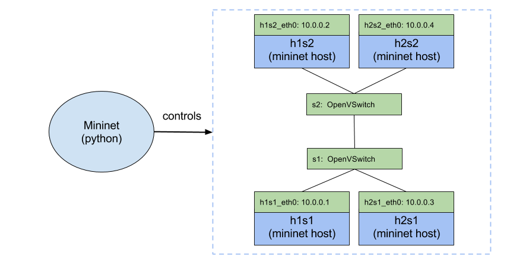

# Mininet

## DEMO



### The CLI way

#### Start mininet with 2 switches and 2 hosts/switch

```bash
vagrant@td-host1:~$ sudo mn --topo linear,2,2
*** Creating network
*** Adding controller
*** Adding hosts:
h1s1 h1s2 h2s1 h2s2
*** Adding switches:
s1 s2
*** Adding links:
(h1s1, s1) (h1s2, s2) (h2s1, s1) (h2s2, s2) (s1, s2)
*** Configuring hosts
h1s1 h1s2 h2s1 h2s2
*** Starting controller
*** Starting 2 switches
s1 s2
*** Starting CLI:
```

The first "2" stands for number for switches; the second one for the number of hosts per switch. The mininet hosts are simply LXC containers - they're based on the private network namespaces.

#### Display nodes and their network configuration

```bash
mininet> nodes
available nodes are:
c0 h1s1 h1s2 h2s1 h2s2 s1 s2
mininet> h1s1 ip a
...
20: h1s1-eth0: <BROADCAST,MULTICAST,UP,LOWER_UP> mtu 1500 qdisc pfifo_fast state UP group default qlen 1000
    link/ether fa:31:00:72:4d:d5 brd ff:ff:ff:ff:ff:ff
    inet 10.0.0.1/8 brd 10.255.255.255 scope global h1s1-eth0
       valid_lft forever preferred_lft forever
    inet6 fe80::f831:ff:fe72:4dd5/64 scope link
    valid_lft forever preferred_lft forever

```

To run a commad in a mininet host prefix it with with the host name, like in the above example: `h1s1 ip a`.

#### Check the connectivity between the containers

```bash
mininet> pingall
*** Ping: testing ping reachability
h1s1 -> h1s2 h2s1 h2s2
h1s2 -> h1s1 h2s1 h2s2
h2s1 -> h1s1 h1s2 h2s2
h2s2 -> h1s1 h1s2 h2s1
*** Results: 0% dropped (12/12 received)
```

#### Run HTTP server/client

```bash
mininet> h1s1 python -m SimpleHTTPServer 8080 &
mininet> h1s2 curl 10.0.0.1:8080
  % Total    % Received % Xferd  Average Speed   Time    Time     Time  Current
                                 Dload  Upload   Total   Spent    Left  Speed
100    38  100    38    0     0   4399      0 --:--:-- --:--:-- --:--:--  4750
<h1>Hello from Hello from host 1</h1>
```

Cleanup:

`h1s1 pkill -f SimpleHTTP`

> When something gets broken you can always run `sudo mn -c` to perform the clean up.

### Python API way

#### Python script

```python
#!/usr/bin/python

from mininet.net import Mininet
from mininet.node import OVSController
from mininet.cli import CLI
from mininet.log import setLogLevel, info

def sampleNet():

    "Create an empty network and add nodes to it."

    net = Mininet( controller=OVSController )

    info( '*** Adding controller\n' )
    net.addController( 'c0' )

    info( '*** Adding hosts\n' )
    h1s1 = net.addHost( 'h1', ip='10.0.0.1' )
    h2s1 = net.addHost( 'h2', ip='10.0.0.3' )
    h1s2 = net.addHost( 'h1', ip='10.0.0.2' )
    h2s2 = net.addHost( 'h2', ip='10.0.0.4' )

    info( '*** Adding switches\n' )
    s1 = net.addSwitch( 's1' )
    s2 = net.addSwitch( 's2' )

    info( '*** Creating links\n' )
    pairs = [(h1s1, s1), (h2s1, s1), (h1s2, s2), (h2s2, s2)]
    [net.addLink( host, switch) for (host, switch) in pairs]

    info( '*** Starting network\n')
    net.start()

    info( '*** Starting HTTP server in h1s1')
    h1s1.cmd('python -m SimpleHTTPServer 8080')

    info( '*** Running CLI\n' )
    CLI( net )

    info( '*** Stopping network' )
    net.stop()

if __name__ == '__main__':
    setLogLevel( 'info' )
    sampleNet()
```

#### Test

```bash
mininet> h1s1 pgrep -fal Simple
568 python -m SimpleHTTPServer 8080
mininet> h1s1 curl 10.0.0.1:8080
  % Total    % Received % Xferd  Average Speed   Time    Time     Time  Current
                                 Dload  Upload   Total   Spent    Left  Speed
  0     0    0     0    0     0      0      0 --:--:-- --:--:-- --:--:--     010.0.0.1 - - [12/Apr/2016 20:42:58] "GET / HTTP/1.1" 200 -
100    38  100    38    0     0   6413      0 --:--:-- --:--:-- --:--:--  7600
<h1>Hello from Hello from host 1</h1>
```

## Resources

* https://github.com/mininet/mininet
* http://mininet.org/
* https://linuxcontainers.org/
