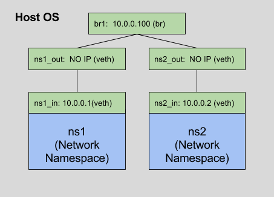

### Linux Network Namespaces

## Requirements ##

* bridge-utils
* `ip` command is useful
* feature of Linux since version 2.6.24

## Concepts

### Network Namespace (ns)

With network namespaces, you can have different and separate instances of network interfaces and routing tables that operate independent of each other.

### Virtual Ethernet Interface (veth)

Special type of network interfaces. They always come in pairs, and they are connected like a tube: whatever comes in one veth interface will come out the other peer veth interface. They are used to connect a network NS to the root (global/default) namespace and further to the outside world.

They are the only type of interfaces that can be assigned to a network namespace.

### The Linux Bridge (br)

A bridge is a way to connect two Ethernet segments together in a protocol independent way. Packets are forwarded based on Ethernet address, rather than IP address (like a router). Since forwarding is done at Layer 2, all protocols can go transparently through a bridge.

The Linux bridge code implements a subset of the ANSI/IEEE 802.1d standard. [1]. The original Linux bridging was first done in Linux 2.2, then rewritten by Lennert Buytenhek. The code for bridging has been integrated into 2.4 and 2.6 kernel series.

## DEMO

It is based on the machines prepared with vagrant in [vagrant-multi-host](https://github.com/mentels/dist-envs/tree/master/vagrant-multi-host)



### Create a NS

```bash
vagrant@td-host1:~/www$ sudo ip netns add ns1
vagrant@td-host1:~/www$ ip netns list
ns1
```

### Create a veth pair

```bash
vagrant@td-host1:~/www$ sudo ip link add ns1_out type veth peer name ns1_in
vagrant@td-host1:~/www$ ip a
...
5: ns1_in: <BROADCAST,MULTICAST> mtu 1500 qdisc noop state DOWN group default qlen 1000
    link/ether da:39:d2:ae:1f:a0 brd ff:ff:ff:ff:ff:ff
6: ns1_out: <BROADCAST,MULTICAST> mtu 1500 qdisc noop state DOWN group default qlen 1000
    link/ether da:da:ec:84:3b:6a brd ff:ff:ff:ff:ff:ff

```

### See that there is a tube

First bring the interfaces up:
```bash
vagrant@td-host1:~/www$ sudo ip link set dev ns1_in up
vagrant@td-host1:~/www$ sudo ip link set dev ns1_in up
```

Then attach `tcpdump` to the one end of the veth pair and try to send ping through the other end (different consoles):

```bash
vagrant@td-host1:~/www$ ping -c3 -I ns1_in 10.0.0.0 # the address doesn't matter
```

```bash
vagrant@td-host1:~$ sudo tcpdump -i ns1_out
tcpdump: WARNING: ns1_out: no IPv4 address assigned
tcpdump: verbose output suppressed, use -v or -vv for full protocol decode
listening on ns1_out, link-type EN10MB (Ethernet), capture size 65535 bytes
18:55:40.324992 ARP, Request who-has 10.0.0.0 tell td-host1, length 28
18:55:41.321945 ARP, Request who-has 10.0.0.0 tell td-host1, length 28
18:55:42.322186 ARP, Request who-has 10.0.0.0 tell td-host1, length 82
```

### Move `ns1_in` to ns1 namespace and assign IP address to it

```bash
vagrant@td-host1:~/www$ sudo ip link set ns1_in netns ns1
vagrant@td-host1:~/www$ sudo ip netns exec ns1 ifconfig ns1_in 10.0.0.1/24 up
vagrant@td-host1:~/www$ sudo ip netns exec ns1 ip a
1: lo: <LOOPBACK> mtu 65536 qdisc noop state DOWN group default
    link/loopback 00:00:00:00:00:00 brd 00:00:00:00:00:00
6: ns1_out: <BROADCAST,MULTICAST,UP,LOWER_UP> mtu 1500 qdisc pfifo_fast state UP group default qlen 1000
    link/ether da:da:ec:84:3b:6a brd ff:ff:ff:ff:ff:ff
    inet 10.0.0.2/24 brd 10.0.0.255 scope global ns1_out
       valid_lft forever preferred_lft forever
    inet6 fe80::d8da:ecff:fe84:3b6a/64 scope link
       valid_lft forever preferred_lft forever

```

### Assign IP address to ns1_out and check ping

```bash
vagrant@td-host1:~/www$ sudo ip addr add 10.0.0.10/24 dev ns1_out
vagrant@td-host1:~/www$ ping 10.0.0.1
PING 10.0.0.2 (10.0.0.2) 56(84) bytes of data.
64 bytes from 10.0.0.2: icmp_seq=1 ttl=64 time=0.065 ms
64 bytes from 10.0.0.2: icmp_seq=2 ttl=64 time=0.085 ms
```

### Repeat the steps for the other namespace

Apart from assigning IP to the ns2_out. Remove one from ns1_out too:

```bash
sudo ip addr del 10.0.0.10/24 dev ns1_out
sudo ip netns add ns2
sudo ip link add ns2_in type veth peer name ns2_out
sudo ip link set ns2_in netns ns2
sudo ip netns exec ns2 ifconfig ns2_in 10.0.0.2/24 up
sudo ip link set dev ns2_out up

```

### Add Linux Bridge to connect two NSs

```bash
sudo brctl addbr br1 # create the bridge
sudo ip link set dev br1 up # bring it up
sudo brctl addif br1 ns1_out # attach the interfaces "plugged" into the NS'es into the bridge
sudo brctl addif br1 ns2_out
brctl show br1
bridge name	bridge id		STP enabled	interfaces #output
br1		8000.427de194d984	no		ns1_out        #output
                                    ns2_out        #output
```


### Try to ping interfaces between NSes

```bash
vagrant@td-host1:~/www$ sudo ip netns exec ns1 ip a
...
7: ns1_in: <BROADCAST,MULTICAST,UP,LOWER_UP> mtu 1500 qdisc pfifo_fast state UP group default qlen 1000
    link/ether 4a:47:bf:2c:b3:7f brd ff:ff:ff:ff:ff:ff
    inet 10.0.0.1/24 brd 10.0.0.255 scope global ns1_in
       valid_lft forever preferred_lft forever
    inet6 fe80::4847:bfff:fe2c:b37f/64 scope link
       valid_lft forever preferred_lft forever
vagrant@td-host1:~/www$ sudo ip netns exec ns2 ip a
...
13: ns2_in: <BROADCAST,MULTICAST,UP,LOWER_UP> mtu 1500 qdisc pfifo_fast state UP group default qlen 1000
    link/ether b2:1d:8b:27:e8:17 brd ff:ff:ff:ff:ff:ff
    inet 10.0.0.2/24 brd 10.0.0.255 scope global ns2_in
       valid_lft forever preferred_lft forever
    inet6 fe80::b01d:8bff:fe27:e817/64 scope link
       valid_lft forever preferred_lft forever
...
sudo ip netns exec ns1 ping 10.0.0.2
```

While the ping is running, in the other console you can see the packets by attaching `tcpdump` to the bridge:

```bash
sudo tcpdump -i br1
...
listening on br1, link-type EN10MB (Ethernet), capture size 65535 bytes
19:14:41.438103 IP 10.0.0.1 > 10.0.0.2: ICMP echo request, id 27346, seq 39, length 64
19:14:41.438195 IP 10.0.0.2 > 10.0.0.1: ICMP echo reply, id 27346, seq 39, length 64
```

### Bridge as an interface

You can also assign an IP address to the bridge:

```bash
vagrant@td-host1:~/www$ sudo ip addr add 10.0.0.100/24 dev br1
vagrant@td-host1:~/www$ ping -c 1 10.0.0.1
PING 10.0.0.1 (10.0.0.1) 56(84) bytes of data.
64 bytes from 10.0.0.1: icmp_seq=1 ttl=64 time=0.069 ms

--- 10.0.0.1 ping statistics ---
1 packets transmitted, 1 received, 0% packet loss, time 0ms
rtt min/avg/max/mdev = 0.069/0.069/0.069/0.000 ms
vagrant@td-host1:~/www$ ping -c 1 10.0.0.2
PING 10.0.0.2 (10.0.0.2) 56(84) bytes of data.
64 bytes from 10.0.0.2: icmp_seq=1 ttl=64 time=0.069 ms

--- 10.0.0.2 ping statistics ---
1 packets transmitted, 1 received, 0% packet loss, time 0ms
rtt min/avg/max/mdev = 0.069/0.069/0.069/0.000 ms
```

<!-- ### Reaching your NS from the outside??? (providing you're in the Vagrant VM) -->

<!-- Yes, it is possible. You need to add another veth with one end in the 192.169.0.0/24 subnet and one in the 10.0.0.0/24. Then appropriate gateways are need  -->

### Teardown

```bash
sudo ip link del ns1_out # removing an one end of the veth pair removes the other as well
sudo ip link del ns2_out
sudo ip netns del ns1
sudo ip netns del ns2
sudo ip link set dev br1 down
sudo brctl delbr br1
```

## Remarks

* Tedious to setup but great power
* Docker is based on this mechanism
* To enable Erlang distributed you have to "do something" with epmd to make it work
* Linux Bridge can be replaces with something more powerful - like OpenVSwitch
* Crazy stuff is possible: like creating the NS in the Vagrant VM with another NS in another vVagrant VM - everything with just this Linux tool

## References

* http://blog.scottlowe.org/2013/09/04/introducing-linux-network-namespaces/
* http://www.linuxfoundation.org/collaborate/workgroups/networking/bridge
* http://man7.org/linux/man-pages/man8/ip-netns.8.html
* An example application: https://github.com/mentels/pair

#### Shortcut for setting the ns1 part of the demo

```bash
sudo ip netns add ns1
sudo ip link add ns1_in type veth peer name ns1_out
sudo ip link set ns1_in netns ns1
sudo ip netns exec ns1 ifconfig ns1_in 10.0.0.1/24 up
sudo ip link set dev ns1_out up
```
