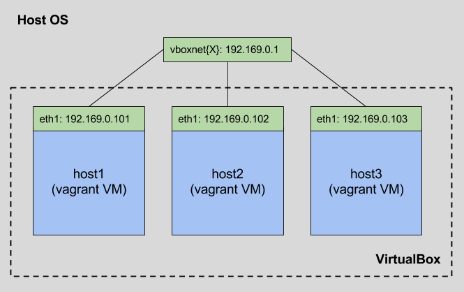
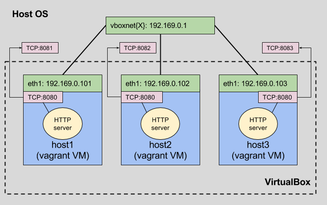

## Vagrant Plugins

1. [vagrant-git](https://github.com/Learnosity/vagrant-git) for managing git repositories
2. [vagrant-vbguest](https://github.com/dotless-de/vagrant-vbguest) for automatically installing VirtualBox Guest Additions
3. [vagrant-hostmanager](https://github.com/devopsgroup-io/vagrant-hostmanager) for automatically managing the `/etc/hosts` file on guest machines - very useful in the multi-machine environment.

## [Vagrant Multi-Machine](https://www.vagrantup.com/docs/multi-machine/)  ##

### Creating ###

To create a multi-machie environment you provide multiple calls to `config.vm.define` in your vagrant file:

```ruby
Vagrant.configure("2") do |config|
  config.vm.provision "shell", inline: "echo Hello"

  config.vm.define "web" do |web|
    web.vm.box = "apache"
  end

  config.vm.define "db" do |db|
    db.vm.box = "mysql"
  end
end
```

Or using loops:

```ruby

config.vm.box = "ubuntu/trusty64"
  config.vm.provider "virtualbox" do |vb|
    vb.memory = 4096
    vb.cpus = 4
  end
  
  (1..3).each do |i|
    config.vm.define "leviathan#{i}" do |node|
      node.vm.hostname = "leviathan#{i}"
      node.vm.network :forwarded_port, guest: 22, host: 2200+i, id: "ssh", auto_correct: true
      node.vm.network :private_network, ip: "192.169.0.10#{i}"
      provision_host node, i
    end
  end

```

### Private networks ###

* allows customized addressing
* easy way to wire VMs with the host




### Customized provisioning

* parametrized provisiong scripts
* parametrized port mappings/addressing
* parametrized host naming

```ruby

$http_server = <<SCRIPT
cd /home/vagrant
mkdir -p www
echo "$1" >> www/index.html
chown -R vagrant: www/
SCRIPT

def provision_host(node, host_id)
  node.vm.provision "http_server",
                    type: "shell",
                    inline: $http_server,
                    args: "Hello from #{host_id}!"
end

Vagrant.configure(2) do |config|
    
  (1..3).each do |i|
    config.vm.define "td-host#{i}" do |node|
      node.vm.hostname = "td-host#{i}"
      node.vm.network :forwarded_port, guest: 8080, host: 8080+i, auto_correct: true
      node.vm.network :private_network, ip: "192.169.0.10#{i}"
      provision_host node, i
    end
  end
  
end
```

### Referencing particular machines

* `vagrant up` starts the whole cluster (unless you set `autostart: false` to one of the machines like: `config.vm.define "db_follower", autostart: false`)

* `vagrant up NAME` brings up only the specified machine

* `vagrant up/ssh/destroy/save/[OTHER] NAME` perform the command against the given machine


## Example

Run `vagrant up`. You will get three VMs with HTTP server running on each of them. Their 80 ports are redirected to 8081, 8082 and 8083 respectively:



#### HTTP Server

Start python SimpleHTTPServer in the /home/vagrant/www direcotry. It contains appropriate `index.html` file:

```bash
vagrant ssh td-host1
python -m SimpleHTTPServer 8080
```
The HTTP server is accessible in two ways on each host:

* `td-host1`
   * http://192.169.0.1:8081/ (through port mapping)
   * http://192.169.0.101:8080/ (through private network)
* `td-host2`
   * http://192.169.0.1:8082/ (through port mapping)
   * http://192.169.0.102:8080/ (through private network)

### Erlang Cluster

On `td-host2`:

`vagrant@td-host2:~/www$ erl -sname b -setcookie ala`

On `td-host1`:

```bash
agrant@td-host1:~/www$ erl -sname a -setcookie ala
Erlang/OTP 18 [erts-7.3] [source-d2a6d81] [64-bit] [smp:2:2] [async-threads:10] [hipe] [kernel-poll:false]

Eshell V7.3  (abort with ^G)
(a@td-host1)1> erlang:get_cookie().
ala
(a@td-host1)2> spawn('b@td-host2', fun() -> io:format("hello from ~p~n", [node()]) end).
<7364.46.0>
hello from 'b@td-host2'
(a@td-host1)3>
```

## Remarks

* duplicated provisioning - for example fetch the same packages for each VM (solvable via plugins)
* downloading the same docker images for the VMs (solvable via sending docker images via ssh)
* by using linked-clones differential disks are used which dramatically speeds-up the process of provisioning a VM

